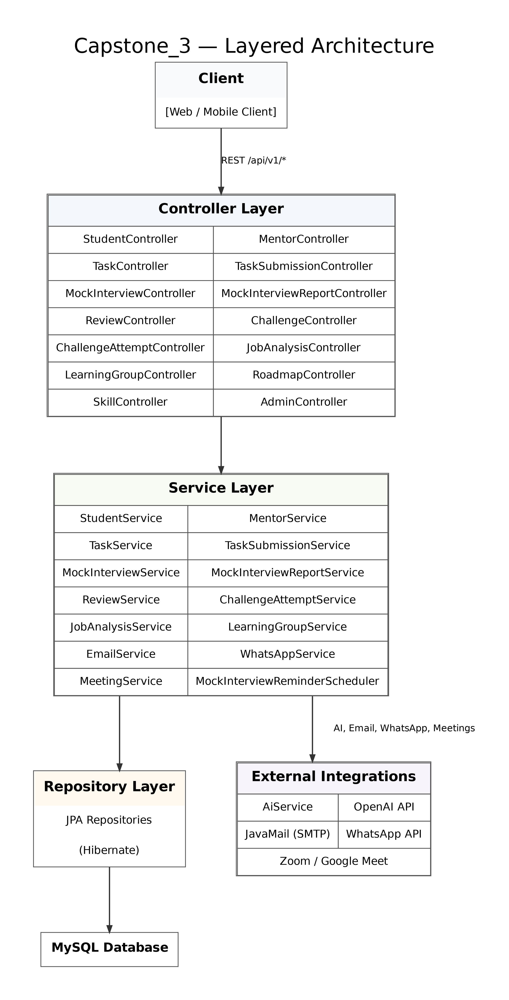
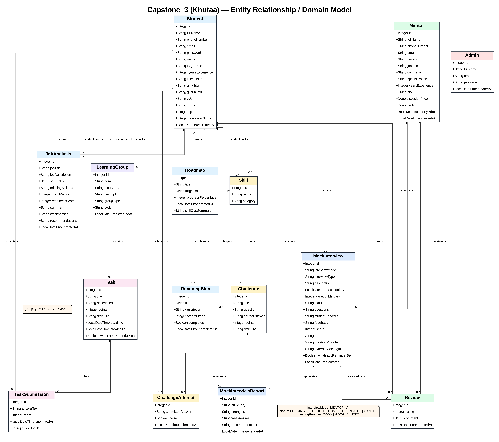
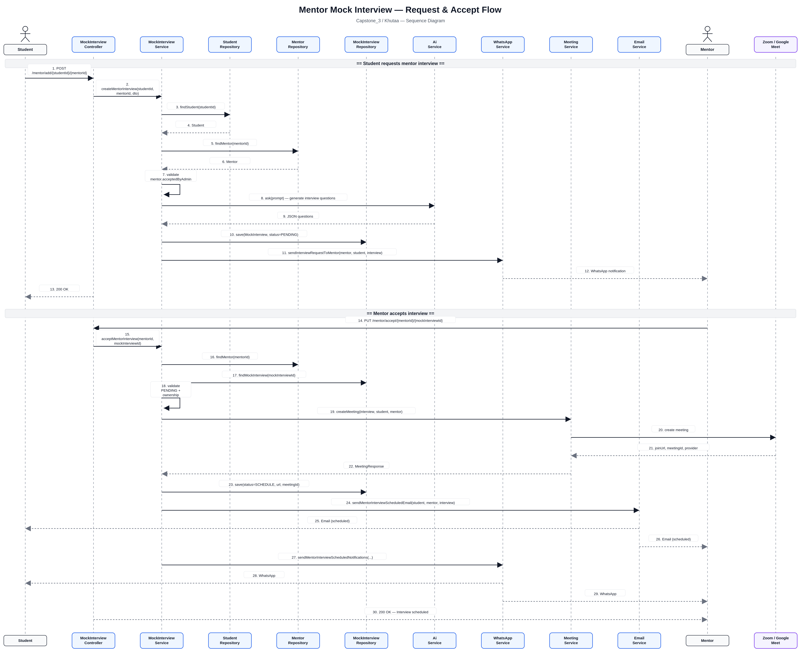
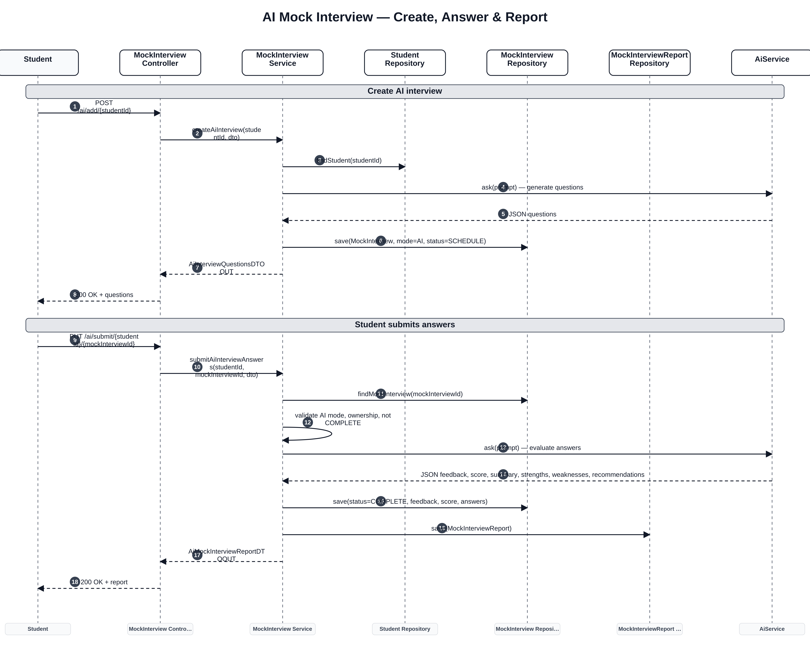
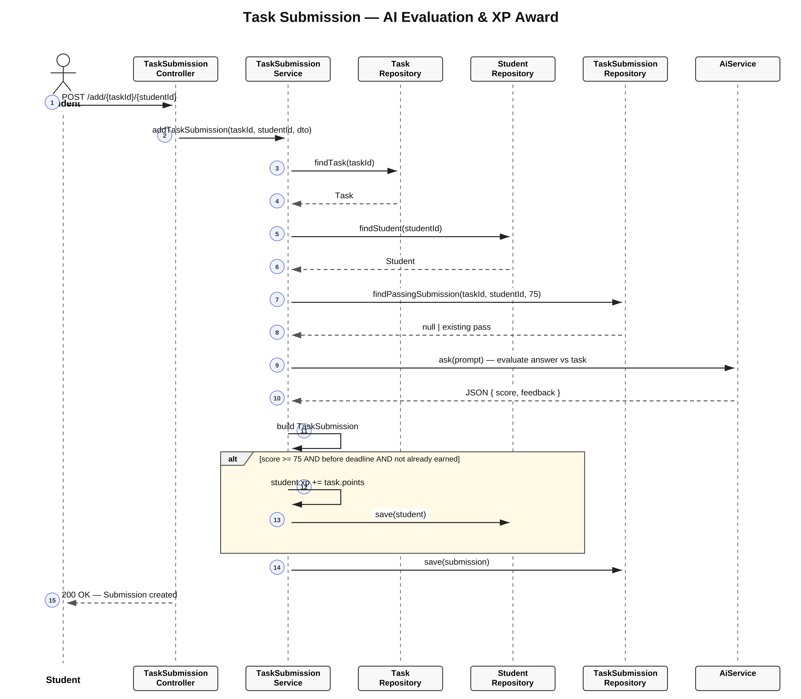
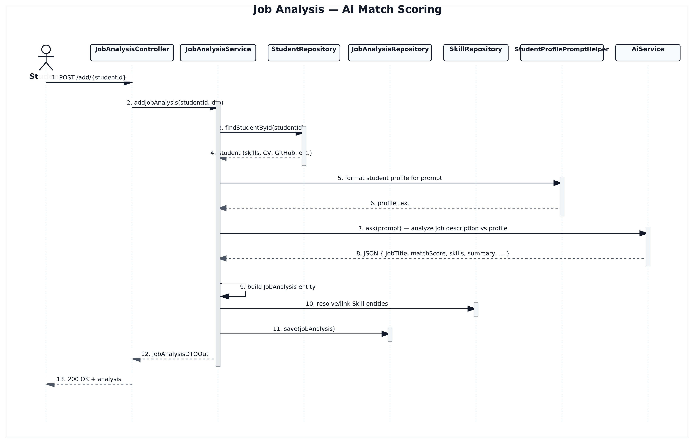
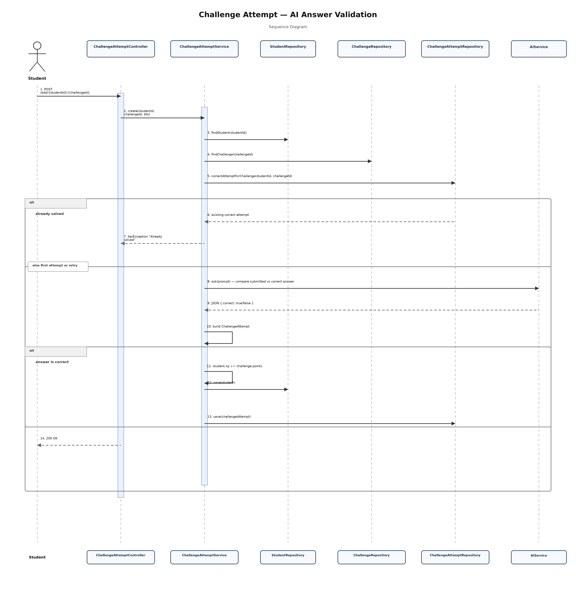
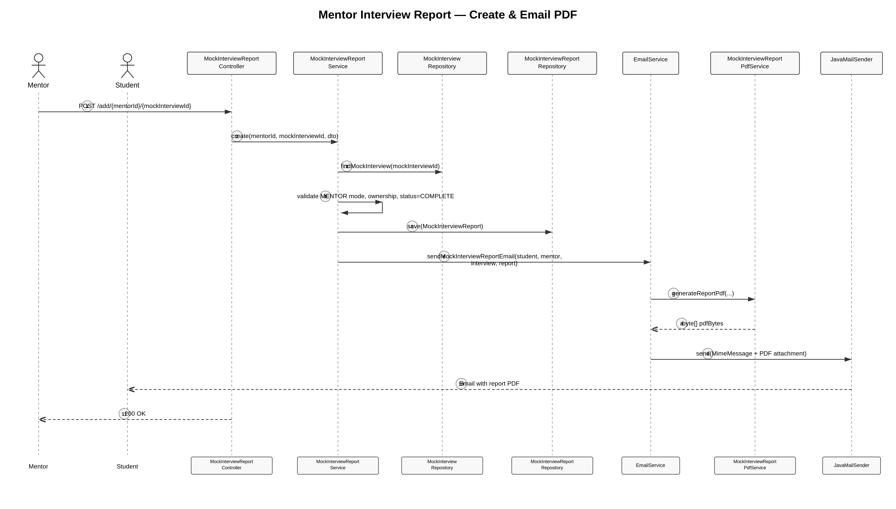
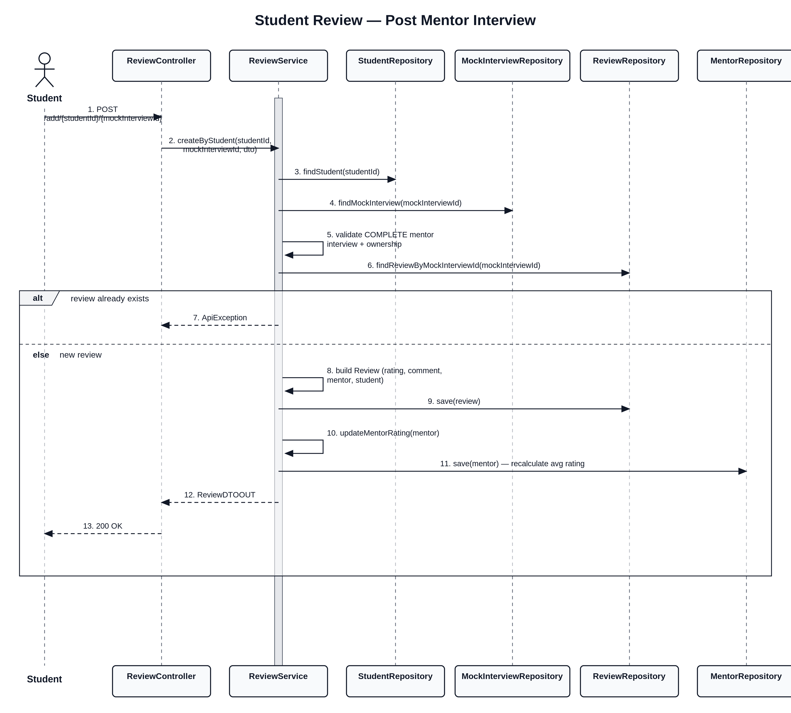
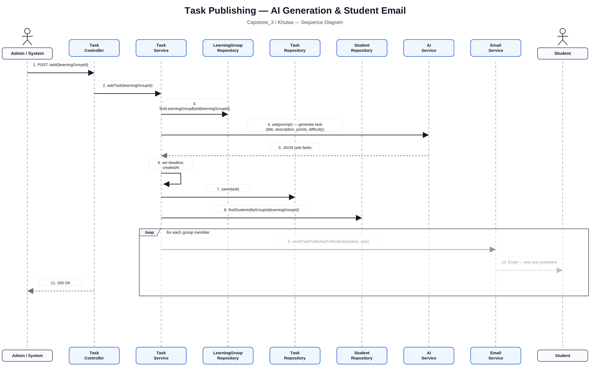

# Khutaa — Capstone 3

**Khutaa** is a Spring Boot backend that helps students prepare for tech careers through AI-powered learning tools, mentor mock interviews, skill tracking, job analysis, challenges, and learning groups.

---

## Table of Contents

- [Overview](#overview)
- [Tech Stack](#tech-stack)
- [Prerequisites](#prerequisites)
- [Getting Started](#getting-started)
- [Configuration](#configuration)
- [Project Structure](#project-structure)
- [Architecture Diagram](#architecture-diagram)
- [Entity Relationship Diagram](#entity-relationship-diagram)
- [Sequence Diagrams](#sequence-diagrams)
- [Team Contributions](#team-contributions)
- [API Base URL](#api-base-url)

---

## Overview

Khutaa supports three main user roles:

| Role | Description |
|------|-------------|
| **Student** | Builds a profile (CV, GitHub), earns XP via tasks and challenges, tracks a career roadmap, analyzes job postings, and books AI or mentor mock interviews |
| **Mentor** | Conducts mock interviews, submits reports, and receives student reviews |
| **Admin** | Manages skills, approves mentors, and oversees platform content |

Key integrations:

- **OpenAI** — task generation, answer grading, job analysis, interview questions, challenge validation
- **Email (SMTP)** — interview scheduling and PDF report delivery
- **WhatsApp (UltraMsg)** — interview request and reminder notifications
- **Zoom / Google Meet** — mentor interview meeting links
- **GitHub API** — student profile enrichment

---

## Tech Stack

| Layer | Technology |
|-------|------------|
| Language | Java 17 |
| Framework | Spring Boot 4.0.6 |
| Persistence | Spring Data JPA / Hibernate |
| Database | MySQL |
| Validation | Jakarta Bean Validation |
| Email | Spring Mail |
| PDF | iText html2pdf, Apache PDFBox |
| Build | Maven |

---

## Prerequisites

- **Java 17+**
- **Maven 3.9+** (or use the included `./mvnw` wrapper)
- **MySQL 8+** with a database named `capstone_3`
- Optional but recommended for full functionality:
  - OpenAI API key
  - SMTP credentials (Gmail App Password or similar)
  - UltraMsg token (WhatsApp)
  - GitHub API token (higher rate limits for profile fetch)

---

## Getting Started

### 1. Clone the repository

```bash
git clone <repository-url>
cd Capstone_3
```

### 2. Create the database

```sql
CREATE DATABASE capstone_3;
```

### 3. Configure local secrets

Copy the example properties file and fill in your values:

```bash
cp src/main/resources/application-local.properties.example src/main/resources/application-local.properties
```

At minimum, set:

```properties
spring.datasource.password=your_mysql_password
openai.api.key=sk-your-key-here
```

See [Configuration](#configuration) for the full list of optional settings.

### 4. Run the application

```bash
./mvnw spring-boot:run
```

On Windows:

```bash
mvnw.cmd spring-boot:run
```

The API starts on **http://localhost:8080** by default.

### 5. Verify

```bash
curl http://localhost:8080/api/v1/student/get
```

---

## Configuration

| Property | Description | Required |
|----------|-------------|----------|
| `spring.datasource.password` | MySQL password | Yes |
| `openai.api.key` | OpenAI API key for AI features | Yes (for AI endpoints) |
| `spring.mail.*` | SMTP settings for email notifications | For email features |
| `ultramsg.api-url` / `ultramsg.token` | WhatsApp notifications | For WhatsApp features |
| `github.api.token` | GitHub API token | Optional (rate limits) |
| `ai.model` | OpenAI model (default: `gpt-4o-mini`) | No |
| `spring.jpa.hibernate.ddl-auto` | Schema mode (default: `update`) | No |

Non-secret defaults live in `src/main/resources/application.properties`. Secrets belong in `application-local.properties` (gitignored).

---

## Project Structure

```
src/main/java/org/example/capstone_3/
├── AI/              # OpenAI integration (AiService, parsers)
├── Api/             # Shared API types (ApiResponse, ApiException)
├── Controller/      # REST endpoints
├── DTO/IN           # Request bodies
├── DTO/OUT          # Response bodies
├── Model/           # JPA entities
├── Repository/      # Spring Data repositories
└── Service/         # Business logic

docs/images/         # Architecture & sequence diagram assets
```

---

## Architecture Diagram



---

## Entity Relationship Diagram



---

## Sequence Diagrams

### Mentor Mock Interview (Request & Accept)



### AI Mock Interview



### Task Submission (AI Grading & XP)



### Job Analysis



### Challenge Attempt



### Mentor Report & Email (PDF)



### Student Review



### Task Publishing



---

## Team Contributions


### Shahad Almalki

| Method | Endpoint | Description |
|--------|----------|-------------|
| `PUT` | `/api/v1/roadmap-step/complete/{student_id}/{roadmap_id}/{step_id}` | Marks a roadmap step as completed for a student |
| `GET` | `/api/v1/challenge/by-skill-and-difficulty/{skillId}/{difficulty}` |  Returns challenges filtered by skill and difficulty level |
| `GET` | `/api/v1/challenge-attempt/student-attempts/{studentId}/{challengeId}` | Returns all attempts made by a student on a specific challenge |
| `POST` | `/api/v1/learning-group/join-private/{student_id}/{code}` | Student joins a private learning group using an invite code |
| `POST` | `/api/v1/learning-group/join-public/{student_id}/{group_id}` | Student joins a public learning group |
| `DELETE` | `/api/v1/learning-group/leave/{student_id}/{group_id}` | Student leaves a learning group |
| `POST` | `/api/v1/learning-group/invite/{inviter_id}/{invited_student_id}/{group_id}` | Invites a student to private learning group |
| `GET` | `/api/v1/task/{learningGroupId}/unsubmitted-tasks/{studentId}` | Returns tasks the student has not yet submitted in a group |
| `GET` | `/api/v1/learning-group/{learningGroupId}/members` | Returns all members of a learning group |
| `GET` | `/api/v1/learning-group/student/{studentId}/groups` | Returns all learning groups a student belongs to |
| `GET` | `/api/v1/task/{learningGroupId}/tasks/available` | Returns currently available tasks in a learning group |
| `GET` | `/api/v1/task/{learningGroupId}/tasks/old` | Returns expired or past tasks in a learning group |
| `GET` | `/api/v1/task-submission/student/{studentId}/task/{taskId}/submissions` | Returns all submissions by a student for a specific task |

---

## API Base URL

```
http://localhost:8080/api/v1
```

All endpoints return JSON. Successful mutations typically respond with an `ApiResponse` message or the created/updated DTO.

Errors are returned with HTTP 4xx/5xx and a message body when `spring.web.error.include-message=always` is enabled.

---

## License

Capstone project — see repository for license details.
